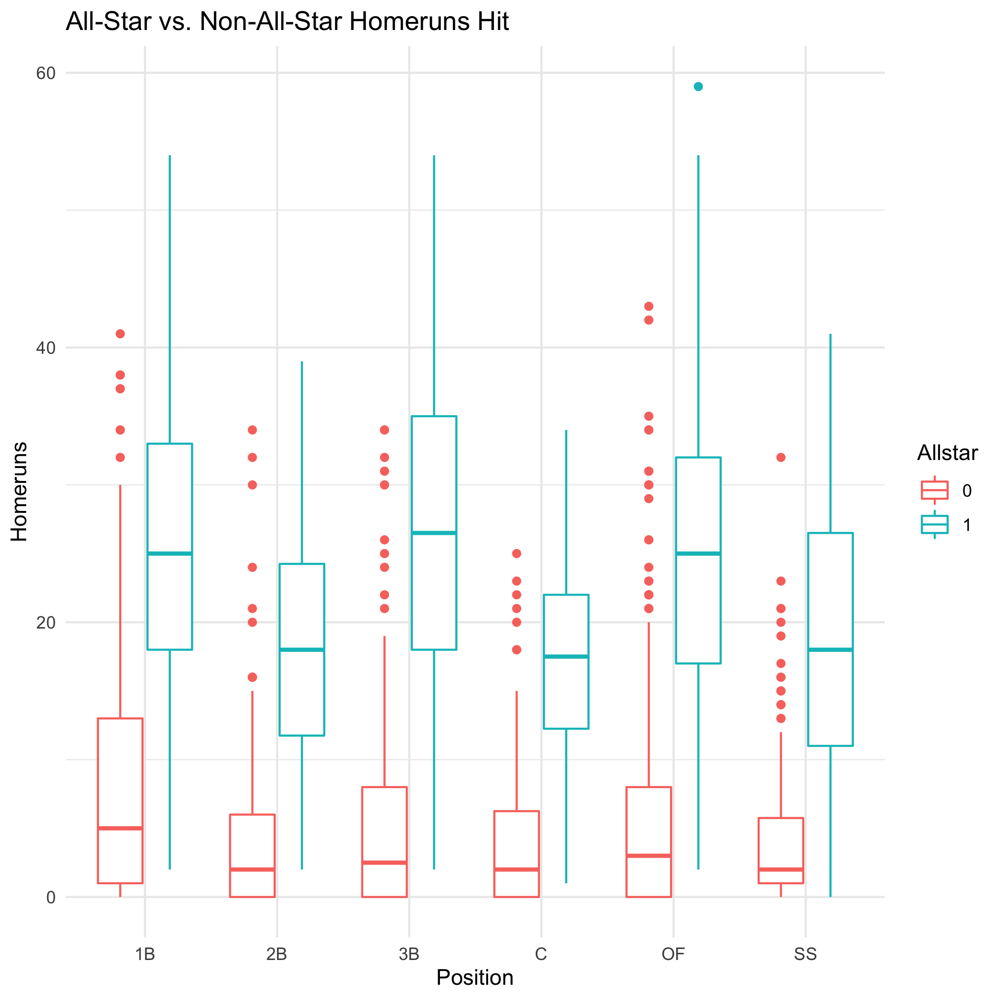
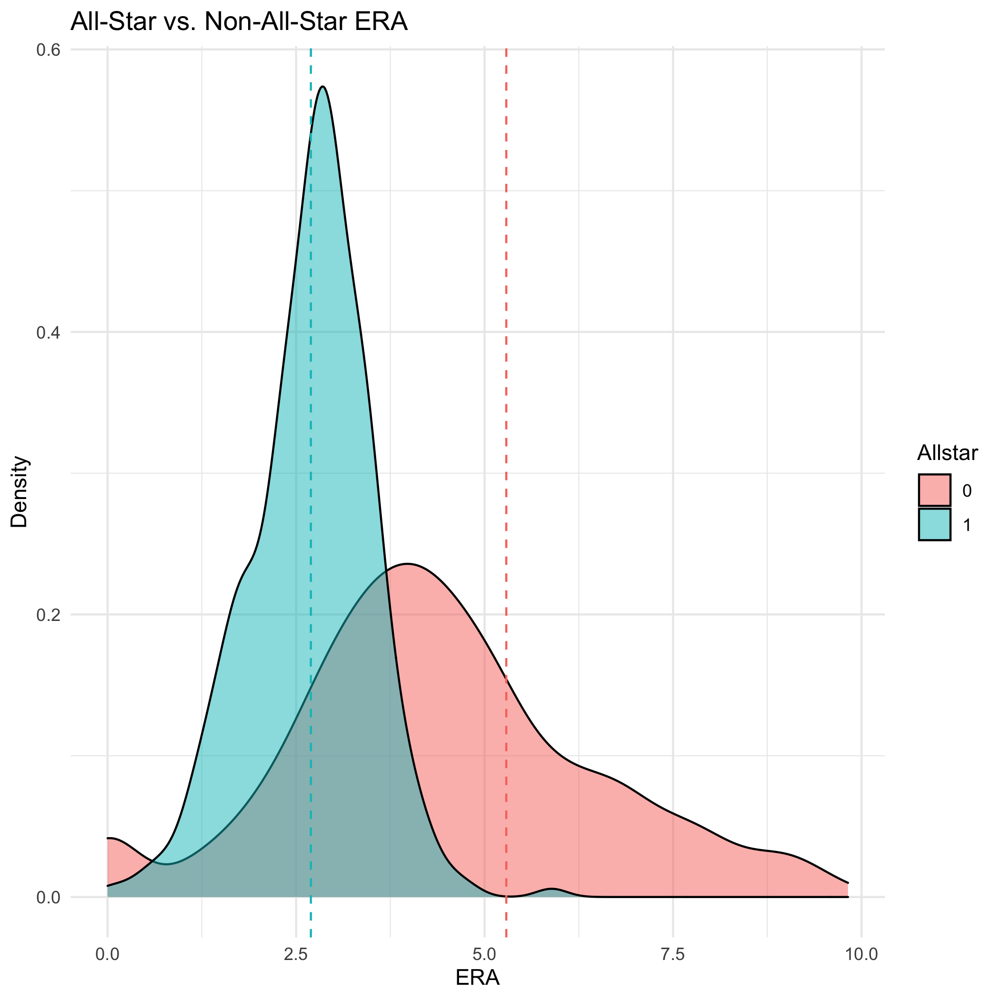

MLB Analysis
============

#### Authors:

Gus Fridell \
Matt Johnson \
Michael Lightfoot

USAGE
-----
You'll need Docker and the ability to run Docker as your current user.

You'll need to build the container:

    > docker build . -t mlb-env

This Docker container is based on rocker/verse. To run rstudio server:

    > docker run -v `pwd`:/home/rstudio -p 8787:8787 -e PASSWORD=mypass -t mlb-env
      
Then connect the machine on port 8787.

Username: rstudio \
Password: mypass

#### Make
Use Makefile as recipe book for building artifacts found in derived directories. 

##### Example:
In local project directory, to build artifact named Analysis.pdf:

    > make Analysis.pdf
    
Use artifacts before colon as make targets. Dependencies are listed after colon. 

***

Introduction
------------

This project contains R code for MLB analysis with the Sean Lahman Database.

### Data:

Data is from the Sean Lahman Baseball Database. Data can be accessed with R Package `Lahman`. Documentation for the package can be found [Here](https://cran.r-project.org/web/packages/Lahman/Lahman.pdf). 

Preliminary Plots
-----------------

